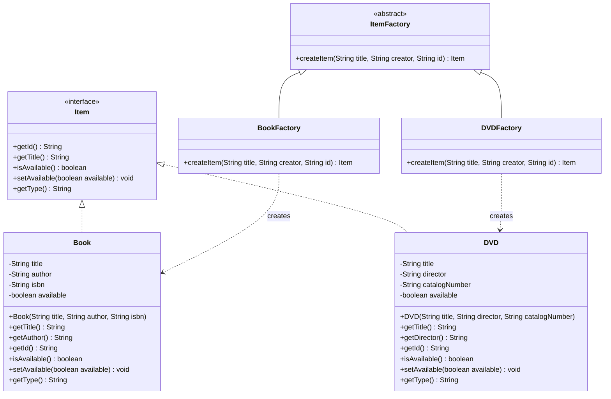

# Factory Method Pattern - UML Diagram

Applied to item creation so the catalog/UI code can create `Item`s
(`Book`, `DVD`, ...) without knowing which concrete class it's building.

**Notes**
- `ItemFactory` is the abstract Creator that declares the factory method `createItem(...)`.
- `BookFactory` and `DVDFactory` are concrete Creators, each overriding `createItem(...)`
  to return their own concrete `Item` subtype.
- Client code (`MenuSystem`) only depends on `ItemFactory` and `Item`, so a new item
  type (e.g. `Magazine`) can be added later by writing a new factory + model class,
  with no changes to existing client code.