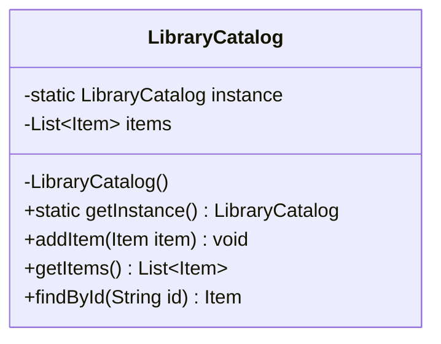

# Singleton Pattern - UML Diagram

Applied to `LibraryCatalog` so the whole application shares exactly one
catalog instance.

**Notes**
- The constructor is `private`, so no other class can call `new LibraryCatalog()`.
- `getInstance()` lazily creates the single instance the first time it's called,
  then returns that same instance on every later call.
- `MenuSystem` and any future class obtain the catalog through
  `LibraryCatalog.getInstance()` instead of creating their own.